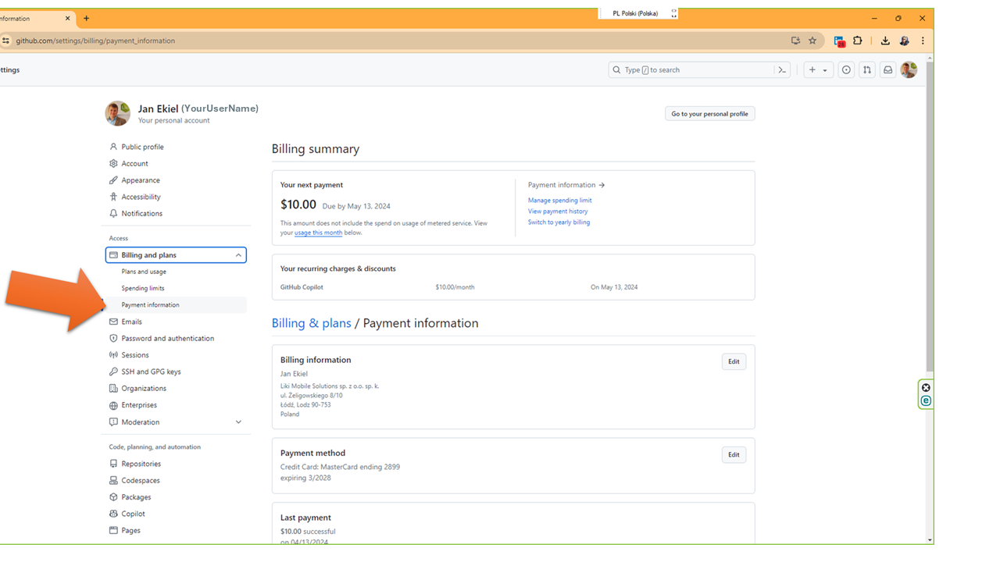
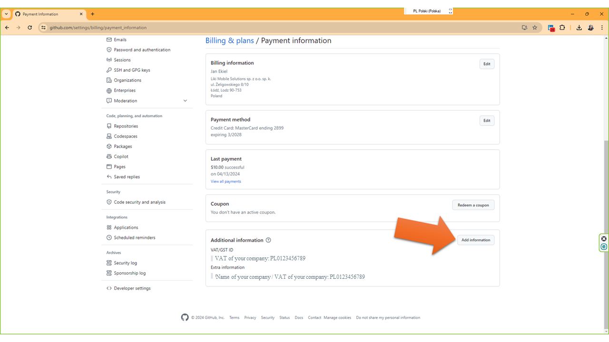
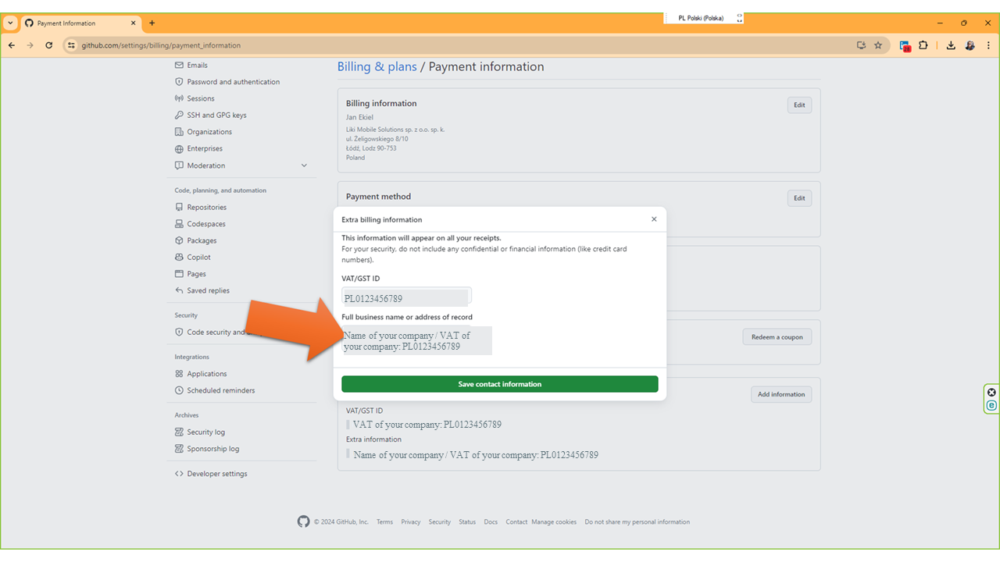

# GitHub VAT Invoice Configuration Guide for EU Businesses

## Introduction
This guide provides a detailed, step-by-step instruction on how to configure your GitHub account to include your business name and VAT number on invoices. This is crucial for businesses within the European Union, where VAT invoices are required to claim tax deductions on business-related expenses. Properly formatted VAT invoices allow businesses to deduct the VAT paid on purchases from their output tax, which can significantly reduce their income tax liability. 

By following this guide, EU-based businesses, especially small businesses and sole proprietors, will be able to ensure their GitHub invoices are compliant with EU tax regulations, enabling them to use these invoices for tax reporting and deductions.

## Why This Is Important
In the EU, to deduct VAT costs for tax purposes, invoices must include the business's name and VAT number. Unfortunately, default GitHub accounts, like individual developer accounts, do not display this information on the provided invoices. This guide will help you adjust your account settings so your invoices meet these requirements.

## Prerequisites
- A GitHub account with billing permissions.
- Your business's official name and VAT number ready to enter.

## Instructions

### Step 1: Access Payment Information
Navigate to `Settings -> Billing and plans -> Payment Information` on your GitHub account.

### Step 2: Add Business Information
In the `Additional Information` section, click on `Add Information`.

### Step 3: Enter Your VAT Information
In the critical step, enter your VAT information in two fields. It is crucial to input your full business name followed by your VAT number in the field labeled `Full business name or address of record`. For example, enter "Your Business Name LLC / VAT: Your-VAT-Number" because this text field is the only one that appears on the invoice and must contain both your business name and VAT number.

### Step 4: View and Print Invoices
Navigate to `View all payments` to see a list of all transactions. From here, you can print your invoices with the correctly displayed business name and VAT number.

## Note
Any changes you make to the business description will also reflect on invoices for past billing periods, which can be very beneficial for accounting and tax purposes.

## Conclusion
By following these steps, you will ensure that your GitHub invoices correctly display the necessary business and tax information, making them valid for tax deductions under EU law. This guide aims to simplify the process and help you maintain compliance with EU tax regulations.
